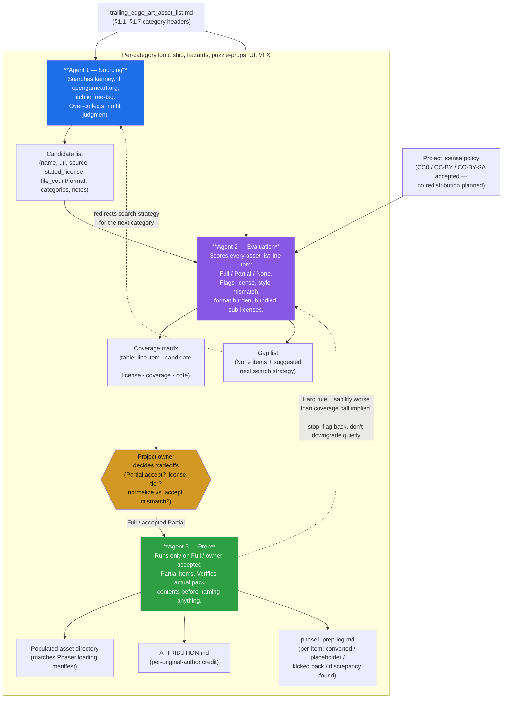

# Asset Procurement Agent Flow

Visual companion to `README.md`. Three role-scoped agents turn
`trailing_edge_art_asset_list.md` into sourced, license-checked,
import-ready assets — run **per category** (ship, hazards, puzzle-props,
UI, VFX), not as one pass over the whole list.

## Reading the diagram

- **Solid arrows** are the normal per-category pipeline: Sourcing → candidate
  list → Evaluation → coverage matrix → owner tradeoff calls → Prep → final
  outputs.
- **Dashed arrows** are the two feedback paths that keep the pipeline honest:
  - Agent 2's gap list redirects Agent 1's search strategy on the *next*
    category (e.g. the Cargo Pod/Beacon Cluster zero-hit finding changed the
    query approach to generic shape-based terms).
  - Agent 3 can kick an item back to Agent 2 mid-prep if its actual,
    opened-up usability is worse than the coverage call assumed — Prep never
    silently re-judges coverage itself.
- The **owner decision diamond** is where License-tier tradeoffs and
  accept-Partial-as-placeholder calls surface — Agent 2 is explicitly barred
  from picking a winner unilaterally when tiers differ.
